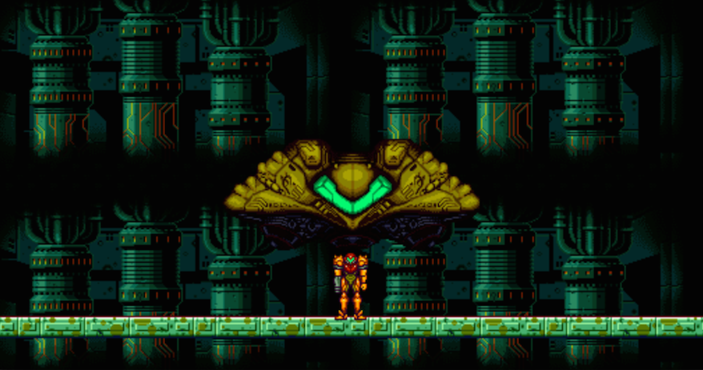

# MetroidPy

Simple videogame based on the classic Metroid programmed in Python and Pygame.

Kill all the metroids, defeat Mother Brain and return to your spaceship!

Sprites obtained from [Super Metroid](https://www.spriters-resource.com/snes/smetroid/) and [Zero Mission](https://www.spriters-resource.com/game_boy_advance/metzero/).

## To play

There are two options to play the game:

- Click on the executable `metroid`

- Run `python metroid.py` in the command line

## Controls

- &#8592; &#8594;: movement

- &#8593;: point up

- &#8595;: Morphball

- Space bar: jump

- X: shoot
